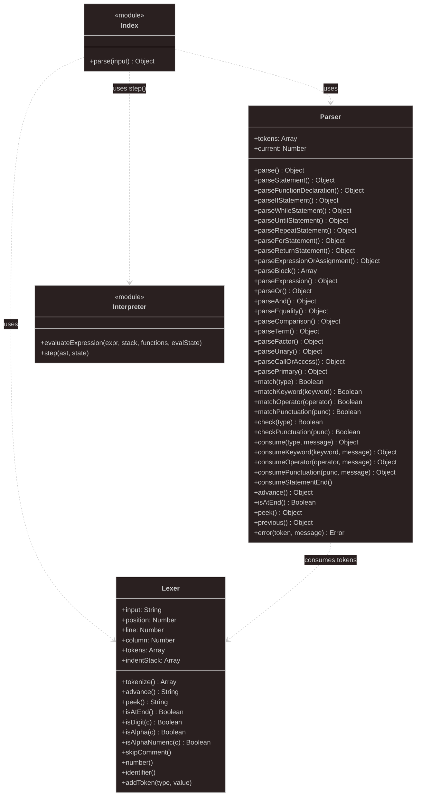

# stepcode


**stepcode** is a specialized tool for generating static books that feature interactive, step-by-step pseudocode execution. Designed for educators and students, it provides a powerful way to visualize algorithm logic and program flow directly in the browser.

---

## Why stepcode?

Learning to code often feels abstract. **stepcode** bridges the gap between static theory and dynamic execution by allowing students to:

1.  **Visualize State**: See exactly how variables change as each line of code is executed.
2.  **Control the Pace**: Step through complex algorithms line-by-line, forwards and backwards.
3.  **Learn through Context**: Read high-quality educational content side-by-side with live code execution.

---

## Key Features

- **Static Site Generation**: Transforms simple Markdown files into a professional, structured educational book.
- **Interactive Pseudocode**: A custom-built interpreter allows users to "play" the code directly in their browser.
- **Visual State Tracking**: Real-time display of variable values and program counter.
- **CLI Debugging**: Run and debug pseudocode files locally in the terminal with the included CLI tool.

## Installation

### GitHub Releases

Download the pre-compiled binary for your architecture from the [GitHub Releases](https://github.com/daniqss/stepcode/releases) page.

### Using Nix

If you are a [Nix](https://nixos.org/) user, you can run **stepcode** directly:

```sh
nix run github:daniqss/stepcode -- <YOUR_BOOK_FOLDER>
```

### From Source

You will need the [Rust toolchain](https://rustup.rs/) installed.

```bash
git clone https://github.com/daniqss/stepcode.git
cd stepcode
cargo build --release
```

The binary will be available at `./target/release/stepcode`.

## Usage

### Generating the Book

To build the static site from the content directory:

```bash
cargo run -- docs
# or
stepcode docs
```

The output will be generated in the `dist` directory.

### Serving the Book

To view the generated book locally, use a static file server:

```bash
npx serve dist
```

### Running the CLI Interpreter

Debug your pseudocode directly in the terminal:

```bash
node interpreter/cli.js path/to/your-code.pseudocode
```

## Project Structure

```bash
stepcode
├── docs/                   # Source content for the book
│   ├── stepcode/           # Markdown files for each lesson/chapter
│   ├── index.md            # Landing page content
│   └── stepcode.toml       # Book configuration and chapter order
├── interpreter/            # CLI version of the pseudocode interpreter
│   ├── cli.js              # Command-line interface entry point
│   └── tests/              # Unit tests for the parser and interpreter
├── src/                    # Site generator source code (Rust)
│   ├── generate.rs         # HTML generation logic and layouts
│   ├── main.rs             # Main entry point for the generator
│   ├── parse.rs            # Logic for parsing Markdown and config files
│   └── tree.rs             # Site structure representation
├── static/                 # Assets for the generated site (embedded in binary)
│   ├── base.css            # Global styles
│   └── index.js            # Frontend orchestrator
├── Cargo.toml              # Rust project configuration
├── package.json            # Node.js scripts and development dependencies
├── flake.nix               # Nix development environment configuration
└── LICENSE.txt             # GPL-3.0 License details
```

### Interpreter diagram



## Roadmap

- [ ] **Complex Data Structures**: Support for arrays, lists, and objects in the interpreter.
- [ ] **Multi-language Support**: Export generated books to different programming languages.
- [ ] **Interactive Quizzes**: Embed assessments directly into the generated chapters.
- [ ] **Theme Support**: Custom CSS themes for the generated static books.

## Development

### Running Tests

To run the interpreter tests:

```bash
cd interpreter
npm test
```

### Formatting and Linting

You can format and lint the entire project at once using **Nix** (if you have it installed and flakes enabled):

```bash
# Format and lint everything (Python, JavaScript, Nix)
nix fmt
```

Alternatively, you can run the tools individually for each language:

#### Python (ruff)

```bash
# Format Python code
ruff format .

# Lint and fix Python code
ruff check --fix .
```

#### Nix (alejandra)

```bash
# Format Nix files
alejandra .
```

#### JavaScript & Assets (ESLint/Prettier)

```bash
# Lint the project
npm run lint

# Format the code
npm run format

# Lint and fix JavaScript
npm run lint:fix
```

## License

This project is licensed under the GPL-3.0-only License. See [LICENSE.txt](LICENSE.txt) for details. For a full list of third-party dependencies and their licenses, see [DEPENDENCIES.md](DEPENDENCIES.md).
