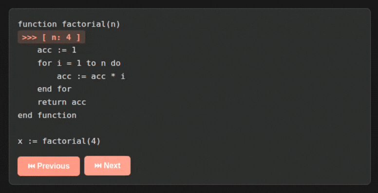
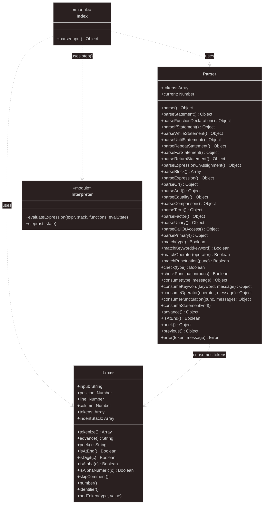

# stepcode




**stepcode** is a specialized tool for generating static books that feature interactive, step-by-step pseudocode execution. Designed for educators and students, it provides a powerful way to visualize algorithm logic and program flow directly in the browser.

---

## Why stepcode?

Learning to code often feels abstract. **stepcode** bridges the gap between static theory and dynamic execution by allowing students to:

1.  **Visualize State**: See exactly how variables change as each line of code is executed.
2.  **Control the Pace**: Step through complex algorithms line-by-line, forwards and backwards.
3.  **Learn through Context**: Read high-quality educational content side-by-side with live code execution.

---

## Key Features

- **Static Site Generation**: Transforms simple Markdown files into a professional, structured educational book.
- **Interactive Pseudocode**: A custom-built interpreter allows users to "play" the code directly in their browser.
- **Visual State Tracking**: Real-time display of variable values and program counter.
- **CLI Debugging**: Run and debug pseudocode files locally in the terminal with the included CLI tool.

## Prerequisites

- **Python** (>= 3.14)
- **uv** (Python package manager)
- **Node.js** (for the CLI and serving the site)

## Installation

1. Clone the repository:

   ```bash
   git clone https://github.com/your-username/stepcode.git
   cd stepcode
   ```

2. Install Python dependencies:
   ```bash
   uv sync
   ```

## Usage

### Generating the Book

To build the static site from the content directory:

```bash
uv run src/main.py docs
```

The output will be generated in the `dist` directory.

### Serving the Book

To view the generated book locally, use a static file server:

```bash
npx serve dist
```

### Running the CLI Interpreter

Debug your pseudocode directly in the terminal:

```bash
node interpreter/cli.js path/to/your-code.pseudocode
```

## Project Structure

```bash
stepcode
├── .github/                # GitHub automation (CI/CD) and community templates
├── assets/                 # Media and visual assets for documentation
├── docs/                   # Source content for the official stepcode book
├── interpreter/            # Core pseudocode engine
│   ├── cli.js              # Command-line interface entry point
│   ├── static/             # Shared logic (Lexer, Parser, Runtime) for CLI and Web
│   └── tests/              # Comprehensive test suite for the interpreter
├── src/                    # Static site generator source code (Python)
│   ├── generate.py         # HTML layouts and site-building logic
│   └── parse_content.py    # Content tree and Markdown parsing
├── static/                 # Global UI assets (CSS and frontend entry point)
├── template/               # Boilerplate/Example for creating new books
├── flake.nix               # Reproducible Nix development environment
├── pyproject.toml          # Python project configuration (uv)
└── package.json            # Node.js scripts and development tools
```

### Community & Governance

To ensure a healthy Open Source ecosystem, we maintain:

- **CONTRIBUTING.md**: Guidelines for code, documentation, and bug reports.
- **GOVERNANCE.md**: Clear model for project decision-making.
- **CODE_OF_CONDUCT.md**: Standards for a welcoming community.
- **AUTHORS.md**: Recognition of all project contributors.

### Interpreter diagram



## Roadmap

- [ ] **Complex Data Structures**: Support for arrays, lists, and objects in the interpreter.
- [ ] **Multi-language Support**: Export generated books to different programming languages.
- [ ] **Interactive Quizzes**: Embed assessments directly into the generated chapters.
- [ ] **Theme Support**: Custom CSS themes for the generated static books.

## Development

### Running Tests

To run the interpreter tests:

```bash
cd interpreter
npm test
```

### Formatting and Linting

You can format and lint the entire project at once using **Nix** (if you have it installed and flakes enabled):

```bash
# Format and lint everything (Python, JavaScript, Nix)
nix fmt
```

Alternatively, you can run the tools individually for each language:

#### Python (ruff)

```bash
# Format Python code
ruff format .

# Lint and fix Python code
ruff check --fix .
```

#### Nix (alejandra)

```bash
# Format Nix files
alejandra .
```

#### JavaScript & Assets (ESLint/Prettier)

```bash
# Lint the project
npm run lint

# Format the code
npm run format

# Lint and fix JavaScript
npm run lint:fix
```

## License

This project is licensed under the GPL-3.0-only License. See [LICENSE.txt](LICENSE.txt) for details. For a full list of third-party dependencies and their licenses, see [DEPENDENCIES.md](DEPENDENCIES.md).
